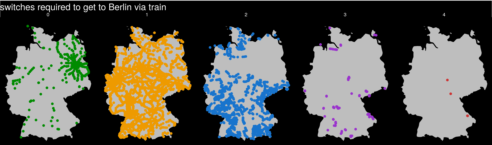
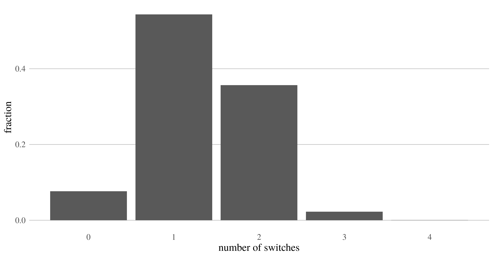

# Routes to Berlin

I got the idea from [this](https://twitter.com/undertheraedar/status/1082682988155097090) twitter thread on how many changes are needed to get to London from any UK city (40.3% of trainstations have direct connection). Here is the respective [Python Code](https://github.com/mm14kwn/rail_connections).
I suspected that Germany is less "centralized" and ran my own analysis.

# Data

the data comes from [germanrailpasses.com](https://www.germanrailpasses.com/plan-your-trip/timetables)
which has a somewhat useable API. The tricky part was to obtain all train stations. I used the list of german cities from Wikipedia to search for trainstations in that particular area. It might thus well be that I missed some stations. See `scrape_stations.R` for the code. Note that `stations.csv` also includes many non-german cities, which are filtered out before getting the trips with `scrape_trips.R`. I randomly choose the 20th of February 2019 as travel date and arrival time before midnight

# Results

On average, 1.23 switches are required to get to Berlin. Only 7% of train stations have a direct connection to Berlin.

